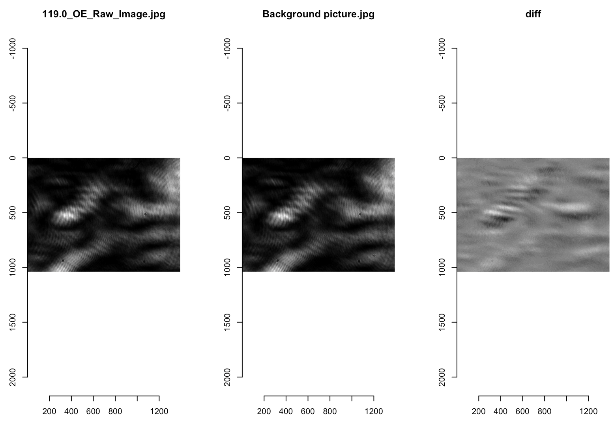

# MOKE-Subtract-Images

Subtracts the background image from a magneto-optical Kerr effect (MOKE) image. This example code shows how an image could be analyzed. The code is based on the image library [imager](https://dahtah.github.io/imager/imager.html).

## Example Output

Here is an example output:

